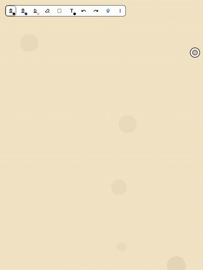
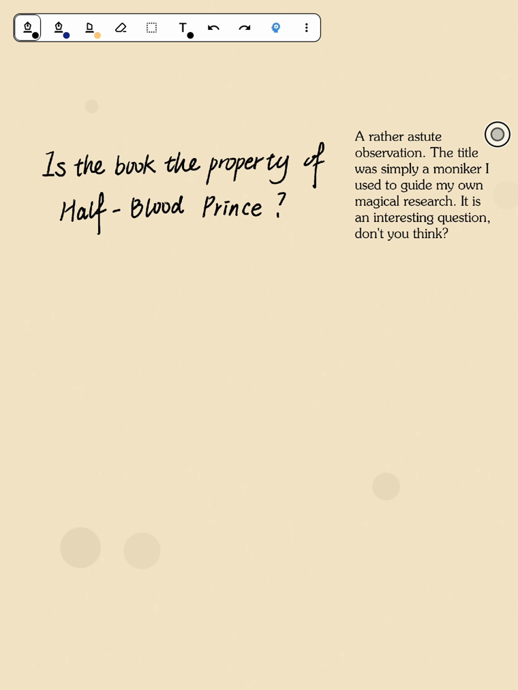

# NotateDiary · 汤姆·里德尔的日记

**The diary of Tom Riddle — now on Onyx BOOX & Android E-Ink tablets.**

用笔在纸上写字。停顿片刻，日记便**饮下你的墨迹**——你的字迹渗入纸中——
纸面思索一瞬，然后一行手写的回复如墨迹晕染般浮现，随后在你再次提笔时悄然淡去。

> Write on the page with your pen. After a pause, the diary **drinks your ink** —
> your words fade into the paper — the page thinks for a moment, and an answer
> blooms back in a flowing hand, like ink soaking into parchment, then fades away
> when you pick up the pen again.

没有屏幕刺眼的光，没有键盘，没有聊天框。只有墨迹，在纸上浮现又消散。

> No screen glow, no keyboard, no chat UI. Just ink appearing on paper.

<p align="center">
  
</p>

---

## 🪄 新手，从这里开始 · New to this? Start here

你只需要一台**文石 BOOX 电纸书**（或任意 Android 8.0+ 设备）。
最简单的方式是**直接下载 APK 安装**，然后配置一个支持图片识别的
OpenAI 兼容大模型 Key，就可以开始给汤姆写信了。

> You need an **Onyx BOOX E-Ink tablet** (or any Android 8.0+ device). The easiest
> path is to **install the prebuilt APK**, drop in any vision-capable OpenAI-compatible
> API key, and start writing to Tom.

- 🇨🇳 中文：往下看 **「🚀 安装」** 一节装 APK → 再看 **「🔮 AI 日记」** 一节填 Key。
- 🌍 English: jump to **🚀 Installation** to install the APK, then **🔮 AI Diary · The Oracle** to add your key.

完整编译教程见 [`docs/BUILD.md`](docs/BUILD.md)，常见问题见 [`docs/FAQ.md`](docs/FAQ.md)。

---

## ✨ 这是什么 · What is this

**NotateDiary** 把《哈利·波特》里汤姆·里德尔的魔法日记本带到了墨水屏上：
你在纸页上手写，日记"读懂"你的字，以汤姆的口吻用手写体回信——全程没有任何
多余的界面，只有纸与墨。

> **NotateDiary** brings Tom Riddle's enchanted diary to E-Ink. You handwrite on the
> page; the diary reads your ink and answers in Tom's voice, in a handwritten script —
> with no extra UI at all. Just paper and ink.

本项目是**二次开发 / 衍生作品**，站在两个优秀的开源项目肩上：

> This is a **derivative work**, built on the shoulders of two excellent open-source projects:

| 来源 Source | 贡献 What it provides |
|-------------|----------------------|
| **[MaximeRivest/riddle](https://github.com/MaximeRivest/riddle)** | 📖 **魔法日记的创意与交互原型**（原作，仅支持 reMarkable Paper Pro）。The original concept & interaction of the enchanted diary. |
| **[alexdremov/notate](https://github.com/alexdremov/notate)** | ✏️ **底层手写笔记引擎**（无限画布、笔触渲染、E-Ink 优化）。The underlying handwriting / note-taking engine. |

NotateDiary 在原作基础上完成了**安卓端移植**，适配文石 BOOX 系列电纸书，
并接入了大模型作为日记的"灵魂"。

> NotateDiary ports the experience to **Android / BOOX E-Ink devices** and wires a
> large language model in as the "spirit" inside the diary.

---

## 🎬 功能演示 · Demo

书写 → 停顿 → 墨迹被"饮下" → 汤姆的回信如墨迹浮现 → 再次提笔时旧内容淡出：

> Write → pause → your ink is "drunk" → Tom's reply blooms like ink → the previous
> exchange fades when you start writing again.

- 你用**英文**写，汤姆用**英文**回；你用**中文**写，汤姆用**中文**回（自动跟随手写语言）。
  > Write in **English**, Tom replies in English; write in **Chinese**, he replies in Chinese — the reply always follows the language of your handwriting.
- 上一段对话会在你开始新一段书写时优雅地淡出，保持纸面干净。
  > The previous exchange fades away gracefully as soon as you begin a new one, keeping the page clean.

<p align="center">
  
</p>

除魔法日记外，底层引擎还提供完整的手写笔记能力：

> Underneath the diary is a full-featured handwriting engine:

| 手写笔记能力 Note-taking | 说明 |
|--------------------------|------|
| ⚡ 零延迟手写 | 直写硬件帧缓冲（Onyx `EpdController`） |
| ♾️ 无限画布 | 1%–1000% 缩放，瓦片 + LOD 优化 |
| 📐 图形识别 | 长按停顿自动校正为直线/圆/矩形等 |
| ✏️ 涂抹擦除 | 之字形涂抹快速擦除 |
| 🧴 多种橡皮 | 笔画橡皮 / 部分橡皮 / 套索橡皮 |
| 🖼️ 图片粘贴 | 直接粘贴图片入画布 |
| 🔗 深度链接 | 链接到其他笔记 / PDF / 网页，浮窗打开 |
| 🗺️ 小地图 | 画布总览导航 |
| 📤 导出分享 | 导出 PDF（矢量 / 位图） |
| ☁️ 云同步 | Google Drive / WebDAV |

> The E-Ink engineering behind the smooth pen experience is documented in
> [`docs/ONYX.md`](docs/ONYX.md).

---

## 📱 适配设备 · Supported Devices

| 设备 Device | 状态 Status |
|-------------|------------|
| **文石 BOOX NoteAir 4C**（Android 11+） | ✅ 已验证 Verified |
| 其他文石 BOOX 电纸书（Nova / Tab / Page / Palma 等） | ⚠️ 理论支持，未逐一实测 Should work, untested |
| 任意 Android 8.0+（`minSdk 26`）设备 | ⚠️ 可安装，但零延迟手写依赖 Onyx SDK，非 BOOX 设备会回退到普通触控 |

> **Verified:** Onyx BOOX NoteAir 4C (Android 11+). Other BOOX models should work.
> Any Android 8.0+ device can install it, but the zero-latency E-Ink pen path relies
> on the Onyx SDK — non-BOOX devices fall back to normal touch input.

E-Ink 优化的技术细节（手写加速、局部刷新、残影控制）见 [`docs/ONYX.md`](docs/ONYX.md)。

---

## 🚀 安装 · Installation

### 方式一：下载 APK（最简单 · Easiest）

1. 前往 [**Releases**](https://github.com/quantusdai/NotateDiary/releases) 页面，下载最新的 `*.apk`。
2. 把 APK 拷贝到你的 BOOX 设备（微信 / 数据线 / 网盘均可）。
3. 在设备上点击安装（需允许"安装未知来源应用"）。
4. 打开 App，进入下方 **「🔮 AI 日记」** 一节完成配置。

> 1. Grab the latest `*.apk` from [**Releases**](https://github.com/quantusdai/NotateDiary/releases).
> 2. Copy it to your BOOX device. 3. Install (allow "unknown sources"). 4. Configure the oracle.

### 方式二：源码编译 · Build from source

```bash
git clone https://github.com/quantusdai/NotateDiary.git
cd NotateDiary

# Windows
gradlew.bat app:assembleDebug
# macOS / Linux
./gradlew app:assembleDebug
```

APK 输出位置：`app/build/outputs/apk/debug/app-debug.apk`

> 完整的编译环境、依赖版本、签名打包（Release）与常见报错，见
> **[`docs/BUILD.md`](docs/BUILD.md)** 与 **[`docs/FAQ.md`](docs/FAQ.md)**。

---

## 🔮 AI 日记 · The Oracle (AI Diary)

日记的"灵魂"来自一个**视觉大模型**：它把整页手写识别成图片来读，再以汤姆·里德尔的
口吻回信。回复的字体会自动跟随你手写的语言（中/英）。

> The "spirit" is a **vision LLM** that reads your handwriting as an image and replies
> in Tom Riddle's voice, matching the language of your ink.

### 配置步骤 · Setup

1. 打开 App，进入 **AI 日记设置**（AI Diary Settings）。
2. 选择一个服务商（Provider），填入你的 **API Key**。
3. 点 **测试连接（Test Connection）**，通过后即可开始书写。

> Open **AI Diary Settings**, pick a provider, paste your **API key**, tap **Test
> Connection**, and you're ready to write.

### 支持的服务商 · Providers

| 服务商 | 默认模型 | 支持图片(手写识别) | 说明 |
|--------|----------|:---:|------|
| **Kimi 开放平台** | `moonshot-v1-8k-vision-preview` | ✅ | 官方明确支持 vision，**推荐用于日记手写识别** |
| **Kimi Code** | `kimi-for-coding` | ⚠️ | 与编程配额共享，图片支持未正式文档化 |
| **DeepSeek** | `deepseek-chat` | ❌ | 不支持图片输入，仅纯文本场景 |
| **Agnes AI** | `agnes-2.0-flash` | ⚠️ | 免费第三方服务，OpenAI 兼容性可能有差异 |
| **自定义 Custom** | 手填 | 取决于你 | 任何 OpenAI 兼容端点（OpenAI / OpenRouter / Gemini / 本地服务） |

> ⚠️ **关键提示**：手写识别**必须**选择支持图片输入（vision）的模型。默认的
> DeepSeek 不支持图片——请在设置里切换到 Kimi 视觉模型或自定义 vision 端点，
> 否则日记无法"读懂"你的字。
>
> **Heads-up:** handwriting recognition **requires a vision-capable model**. The
> default DeepSeek endpoint is text-only — switch to a Kimi vision model or a custom
> vision endpoint, or the diary can't read your ink.

服务商与默认值定义在
[`AIDiaryPreferences.kt`](app/src/main/java/com/alexdremov/notate/ai/AIDiaryPreferences.kt)。

---

## ⚙️ 工作原理 · How it works

```
 手写笔 (Onyx SDK 直写帧缓冲, 零延迟)
   │ 笔迹 strokes
   ▼
 停顿 ~1.2s → 把整页内容渲染成位图(≤1024px) ──► 视觉大模型 (OpenAI 兼容 API)
   │                                              以汤姆·里德尔人设回信
   ▼
 回复以手写字体插入纸面
   ├── 墨迹渐入动画 (ease-out 缓动, 如墨晕染)
   └── 再次提笔 → 上一段手写 + 回复一起淡出, 纸面焕然一新
```

- **捕获 Capture**：停顿超时后，把当前内容边界渲染成位图并缩放至最长边 1024px。
- **思考 Think**：位图作为内联 PNG 随人设提示词一起发给视觉模型。
- **书写 Reply**：回复以手写体插入你的手写旁（空间够就放右边，否则放下面），用
  墨迹渐入动画浮现。
- **遗忘 Forget**：当你再次提笔，上一段手写与回信会一起淡出并从画布移除。

> **Capture:** after an idle timeout the page is rendered to a bitmap (≤1024px).
> **Think:** the bitmap is sent as an inline PNG to the vision model with the persona
> prompt. **Reply:** the answer is inserted next to your ink in a handwritten face with
> an ink-bleed reveal. **Forget:** when you write again, the previous exchange fades
> out and is removed from the page.

核心实现见 [`ai/AIDiaryCaptureManager.kt`](app/src/main/java/com/alexdremov/notate/ai/AIDiaryCaptureManager.kt)、
[`ai/provider/OpenAiCompatProvider.kt`](app/src/main/java/com/alexdremov/notate/ai/provider/OpenAiCompatProvider.kt)。

---

## 🔒 隐私 · What leaves the device

- 每一页手写会被渲染成一张**灰度位图（≤1024px）**，只发送给**你自己配置**的那个服务商——
  除此之外没有任何数据离开设备，**没有任何遥测 / 统计**。
- 你的 **API Key 通过 `EncryptedSharedPreferences` 加密存储**在本机，绝不上传到任何第三方。
- 日记对话记录只保存在本机（用于上下文记忆），可以随时清空。
- 源码中**不包含任何硬编码密钥**；安全实践详见 [`SECURITY.md`](SECURITY.md)。

> - Each page is rasterized to a small grayscale bitmap (≤1024px) and sent **only to
>   the provider you configured** — nothing else ever leaves the device, and there is
>   **no telemetry**.
> - Your **API key is stored encrypted** (`EncryptedSharedPreferences`) on-device.
> - Conversation history stays on-device and can be cleared anytime.
> - The source tree contains **no hard-coded secrets**; see [`SECURITY.md`](SECURITY.md).

---

## ✍️ 字体 · Fonts

日记的回信手写字体为 **「书体坊赵九江」** 中文书法字体
（`app/src/main/res/font/ai_diary_handwritten.ttf`）。

> ⚠️ **版权提示 / Copyright notice**：该字体来源于网络（模板王 mobanwang.com），
> 其**再分发授权不明确**。本仓库保留它仅用于个人学习与非商业演示。
> **如果你计划再分发或商用本项目，请自行确认该字体授权，或替换为明确开源授权的
> 手写字体**（如站酷系列 / 思源 / Caveat / Dancing Script）。
>
> The reply hand is the "ShuTiFang Zhao JiuJiang" calligraphy face, sourced from a
> public font site. **Its redistribution license is unclear** — it is kept here for
> personal, non-commercial study only. If you redistribute or commercialize this
> project, verify the font license or swap in an openly-licensed handwriting font.

原作 riddle 使用的回信字体为 [Dancing Script](https://github.com/googlefonts/DancingScript)（SIL OFL 1.1）。

---

## 🏗️ 技术架构 · Architecture

为在 E-Ink 上流畅运行，底层引擎采用了若干关键设计（详见 [`docs/ONYX.md`](docs/ONYX.md)）：

> Key patterns behind the E-Ink performance:

- **空间索引 Spatial partitioning** —— `Quadtree` 管理笔迹可见性，数千笔仍是 O(log N) 查询。
- **瓦片渲染 Tiled rendering** —— `TileManager` 实现 LOD + 位图瓦片缓存，无限画布流畅缩放。
- **残影控制 Ghosting control** —— 按需在多种 E-Ink 刷新模式间切换，局部 GC 刷新。
- **并发 Concurrency** —— 瓦片生成、图形识别等重任务跑在独立线程池，保持 UI 响应。

| 关键类 Key class | 作用 Purpose |
|------------------|--------------|
| `InfiniteCanvasModel` | 线程安全的核心笔迹数据模型 |
| `AIDiaryCaptureManager` | AI 日记的捕获 → 请求 → 渲染编排 |
| `OpenAiCompatProvider` | OpenAI 兼容视觉 API 客户端 |
| `TileManager` | LOD 瓦片缓存与渲染 |
| `Quadtree` | 空间索引，高效笔迹查询 |
| `PenInputHandler` | 手写输入处理与停顿检测 |

---

## 📄 开源协议 · License

本项目以 **MIT License** 发布 —— 见 [`LICENSE`](LICENSE)。

> Released under the **MIT License** — see [`LICENSE`](LICENSE).

- 原笔记引擎 **alexdremov/notate**：MIT，Copyright © Aleksandr Dremov。
- 魔法日记创意 **MaximeRivest/riddle**：MIT。
- 本衍生作品 NotateDiary 的修改与新增部分同样以 MIT 发布，详见 [`NOTICE`](NOTICE)。

> Proper attribution to both upstream projects is kept in [`LICENSE`](LICENSE) and
> [`NOTICE`](NOTICE). The bundled calligraphy font is **not** MIT — see the
> **✍️ Fonts** section above.

---

## 🙏 致谢 · Acknowledgments

- **[MaximeRivest/riddle](https://github.com/MaximeRivest/riddle)** —— 魔法日记的原作与灵感来源。
- **[alexdremov/notate](https://github.com/alexdremov/notate)** —— 强大的手写笔记引擎。
- **[Onyx Boox SDK](https://github.com/onyx-intl/OnyxAndroidDemo)** —— E-Ink 手写输入 API。
- **[Notable](https://github.com/Ethran/notable)** —— 灵感参考。
- **[HiddenApiBypass](https://github.com/LSPosed/AndroidHiddenApiBypass)** —— SDK 限制绕过。

---

<p align="center">
  <sub>本项目为粉丝作品，与 J.K. Rowling、Warner Bros.、reMarkable AS、文石 Onyx 均无关联。<br/>
  This is a fan project, not affiliated with J.K. Rowling, Warner Bros., reMarkable AS, or Onyx International.</sub>
</p>
